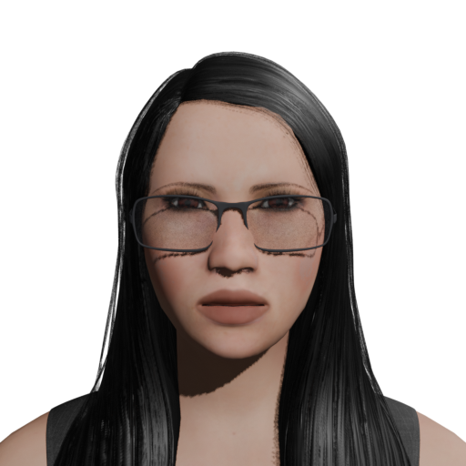
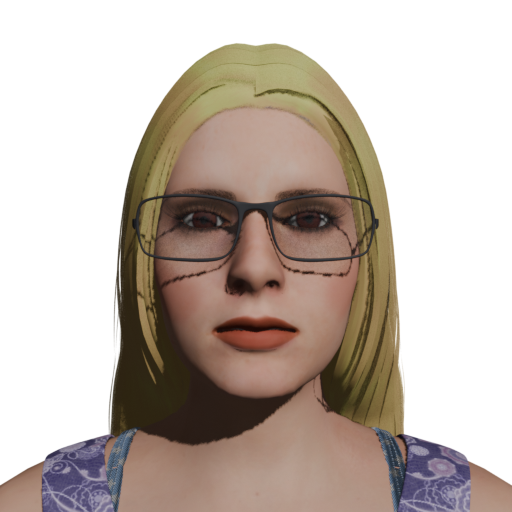
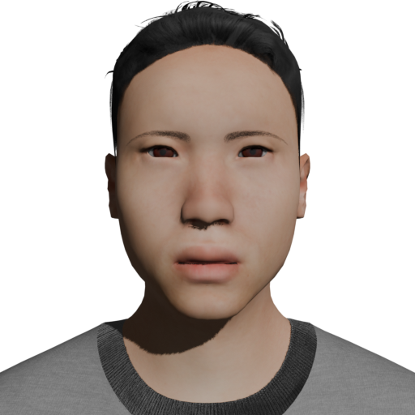
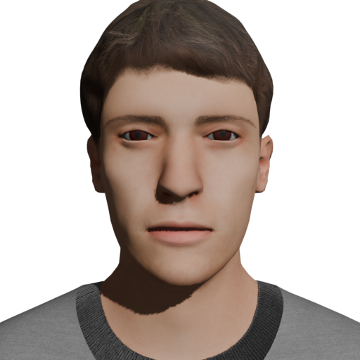

# Amisoria

**An AI companion with a voice, a face, and your language — running on your own Mac.**
**會說話、有表情、用你的語言陪你聊天的 AI 伙伴——跑在你自己的 Mac 上。**

<p align="center">
  
  
  
  
</p>

Amisoria is an iPhone app that gives an [OpenClaw](https://openclaw.ai) agent a real-time 3D presence:
neural voice, lip-sync, expressions, 20 languages, four characters, and your choice of AI model
(GPT, Claude, Gemini, DeepSeek, Grok, Qwen, or a local Ollama model). Your gateway lives on your
own always-on Mac (a Mac mini is ideal); your phone reaches it over a private Tailscale network.
**No Amisoria servers. Your conversations never leave your devices and the providers you choose.**

| | |
|---|---|
| 📲 **App** | Amisoria on the App Store (coming soon) |
| 🛠️ **Set up your Mac mini** | [English](docs/en/install-mac-mini.md) · [繁體中文](docs/zh-Hant/install-mac-mini.md) |
| 📖 **User guide** | [English](docs/en/user-guide.md) · [繁體中文](docs/zh-Hant/user-guide.md) |
| 🔒 **Privacy policy** | [PRIVACY.md](PRIVACY.md) |
| 🧩 **Host tooling** | [`host/setup-host.sh`](host/setup-host.sh) (one-shot configurator) · [`host/amisoria-bridge.py`](host/amisoria-bridge.py) |
| 🎭 **Characters** | [`assets/characters/`](assets/characters/) — Blender sources + mobile GLBs, **CC BY-NC 4.0** (commercial use needs permission, see [assets/LICENSE](assets/LICENSE)) |

## How it fits together

```
 iPhone (Amisoria app)                    Mac mini (always on)                     Cloud / local
 ┌───────────────────┐   Tailscale HTTPS  ┌─────────────────────────────┐
 │ 3D stage (three.js)│◀────── wss ──────▶│ OpenClaw gateway :18789      │──▶ OpenAI / Anthropic /
 │ voice + lip-sync   │◀──── /bridge ────▶│ Amisoria bridge  :18790       │    Google / OpenRouter
 │ 20-language STT    │                   │  (voice audio, keys, balance)│──▶ Ollama (local, optional)
 └───────────────────┘                    └─────────────────────────────┘
```

- **Device identity:** the phone signs the gateway's challenge with an Ed25519 key; you approve it once on the Mac (`openclaw devices approve`).
- **Voice:** Microsoft neural voices synthesized by your gateway (free, 20 languages, male/female per character); on-device voice as fallback and in demo mode.
- **Demo mode:** try everything with no server at all.

## What's in this repo (public)

Everything you need to **host** Amisoria: setup script, bridge service, guides, privacy policy, and the character assets.
The iOS app source is private.

## Requirements

- Mac with Apple Silicon, macOS 14+ (16 GB RAM+ if you want a local model)
- iPhone, iOS 17+
- [Tailscale](https://tailscale.com) (free) on both
- An API key from at least one provider (OpenAI / Anthropic / Google AI Studio / OpenRouter)

## License

Code & docs: [MIT](LICENSE). Character assets: [CC BY-NC 4.0](assets/LICENSE).
Built with [OpenClaw](https://openclaw.ai), [TalkingHead](https://github.com/met4citizen/TalkingHead) (MIT), [three.js](https://threejs.org), [MakeHuman / MPFB](https://static.makehumancommunity.org/mpfb.html) (CC0 assets).

© 2026 Glen Chen (Amisoria)
